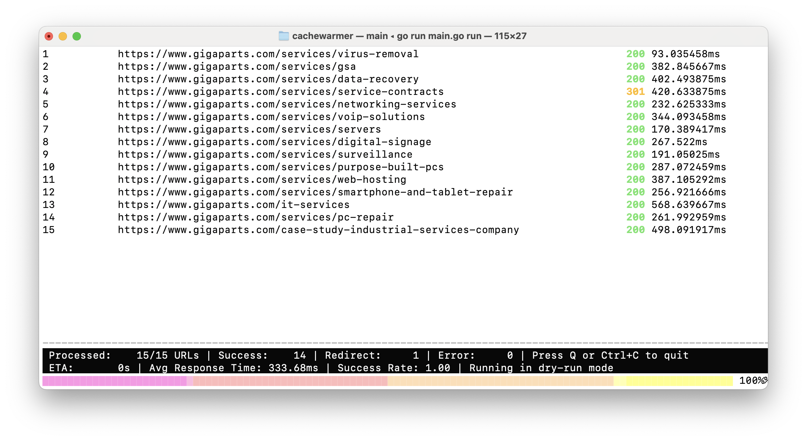

# Go Cache Warmer

[](https.://goreportcard.com/report/github.com/maksymhryb/gocachewarmer)

GoCacheWarmer is developed as part of educational project to learn Golang in general and Golang's concurrency model specifically.

## UI Overview



## Features

-   **Sitemap Parsing**: Automatically parses sitemaps to discover URLs.
-   **Concurrent Requests**: Performs multiple HTTP requests concurrently for faster warming.
-   **Filtering**: Filters URLs based on patterns, status codes, and response times.
-   **Reporting**: Generates detailed CSV reports, including aggregate statistics.
-   **Configuration**: Supports both command-line flags and a YAML configuration file.
-   **Dry Run Mode**: Simulates the warming process without making actual HTTP requests.
-   **Interactive UI**: Provides a real-time view of the warming progress with an interactive terminal UI.

## Installation

```bash
go get -u github.com/maksymhryb/gocachewarmer
```

## Usage

The application has two main commands: `run` and `generate-config`.

### `run`

Executes the cache warming process.

```bash
cachewarmer run [flags]
```

### `generate-config`

Generates a default `config.yaml` file in the current directory.

```bash
cachewarmer generate-config
```

## Configuration

Configuration can be provided via command-line flags or a `config.yaml` file. If a `config.yaml` file exists in the same directory, it will be loaded automatically. Command-line flags will override the values from the configuration file.

### Command-line Flags

| Flag                        | Description                                                                                         | Default                                |
| --------------------------- | --------------------------------------------------------------------------------------------------- | -------------------------------------- |
| `-sitemap-url`              | Sitemap URL                                                                                         | ""                                     |
| `-report-name`              | Report file name                                                                                    | "cachewarmup_report.csv"               |
| `-aggregate-report-name`    | Aggregate report file name                                                                          | "cachewarmup_aggregate_report.csv"     |
| `-log-name`                 | Log file name                                                                                       | "cachewarmup.log"                      |
| `-user-agent`               | User agent                                                                                          | "GoCacheWarmer"                        |
| `-filter-input-url`         | Filter URLs from sitemap that will be warmed up, allowed `*` symbol for pattern matching              | ""                                     |
| `-filter-output-status`     | Filter URLs in report by status mask (e.g., "2XX", "500")                                           | ""                                     |
| `-concurrent-requests`      | Amount of concurrent HTTP-requests                                                                  | 10                                     |
| `-connection-timeout`       | Connection timeout in seconds for HTTP-requests                                                     | 30                                     |
| `-limit`                    | Amount of URLs from sitemap that will be processed                                                  | 0 (no limit)                           |
| `-skip-logs`                | Skip logs                                                                                           | false                                  |
| `-skip-report`              | Skip main report creation                                                                           | false                                  |
| `-skip-aggregate-report`    | Skip aggregate report creation                                                                      | false                                  |
| `-dry-run`                  | Will imitate warmup requests instead of doing real HTTP-requests                                    | false                                  |
| `-filter-output-response-time` | Filter URLs in report above threshold (e.g., "200ms", "1.5s")                                     | 0s                                     |

### `config.yaml`

Here is an example of a `config.yaml` file with all available options:

```yaml
sitemap-url: "https.://www.example.com/sitemap.xml"
report-name: cachewarmup_report.csv
aggregate-report-name: cachewarmup_aggregate_report.csv
log-name: cachewarmup.log
user-agent: GoCacheWarmer
filter-input-url: "*services*"
filter-output-status: ""
concurrent-requests: 10
connection-timeout: 30
limit: 50
skip-logs: false
skip-report: false
skip-aggregate-report: false
use-date-suffix: false
dry-run: true
filter-output-response-time: 0s
```

## Contributing

Contributions are welcome! Please feel free to submit a pull request or open an issue.

## License

This project is licensed under the MIT License.
